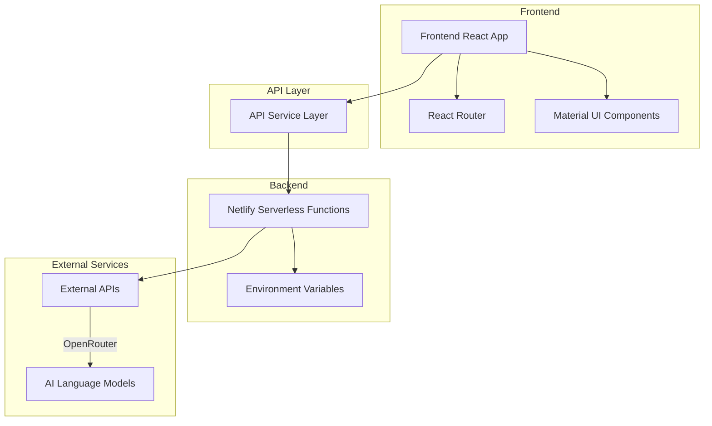
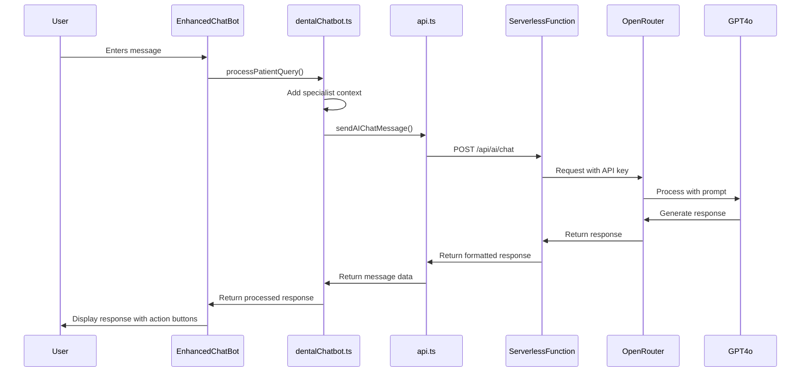
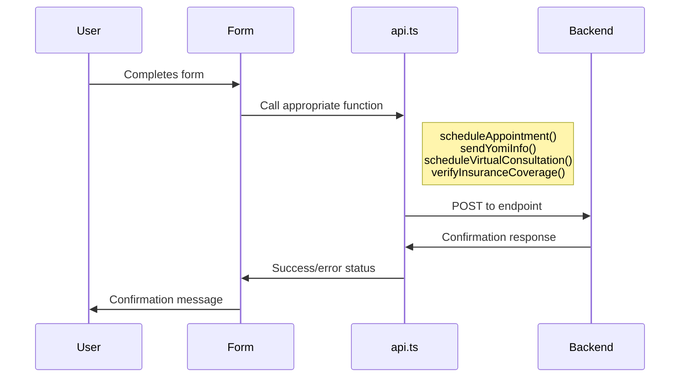

# System Architecture Documentation

This document provides a comprehensive overview of the Dr. Greg Pedro dental practice website architecture, explaining how the various components interact with each other.

## High-Level Architecture

The website follows a modern architecture with the following key components:

## Component Breakdown

### Frontend

- **React with TypeScript**: The application is built using React with TypeScript for type safety.
- **Material UI**: Used for consistent styling and responsive UI components.
- **React Router**: Handles navigation between different pages.
- **Component Structure**:
  - **Layout Components**: Header, Footer, overall page layout
  - **UI Components**: Reusable elements like ServiceCard, TestimonialCard, HeroSection
  - **Page Components**: HomePage, ServicesPage, ContactPage, etc.
  - **AI Components**: EnhancedChatBot for interactive patient communication

### API Layer

The application uses a service-based approach for API communication:

- **api.ts**: Central service for all API calls
- **dentalChatbot.ts**: Specialized service for AI chatbot functionality
- **modelSelector.ts**: Service for selecting appropriate AI models
- **supabase.ts**: Service for database interactions (if applicable)

### Backend

- **Netlify Serverless Functions**: Handle secure communication with external services
  - Located in `/netlify/functions/`
  - Key function: `ai-chat.js` - proxies requests to OpenRouter

### External Services

- **OpenRouter API**: Provides access to advanced language models like GPT-4o
- **Optional Integrations**: Supabase for data storage

## Data Flow Diagrams

### AI Chatbot Flow

### Patient Form Submission Flow

## Security Architecture

The website employs several security measures to protect sensitive information:

1. **API Key Protection**:
   - API keys for external services like OpenRouter are stored as environment variables
   - Keys are never exposed in frontend code
   - All API calls that require authentication are proxied through serverless functions

2. **Data Handling**:
   - Patient information is transmitted securely
   - Form data is validated before submission

3. **Request Validation**:
   - Serverless functions validate incoming requests before processing
   - Error handling prevents exposing sensitive information

## Component Interaction Examples

### Example 1: User Asking About Yomi Implants

1. User enters a question about Yomi implants in the chat interface
2. `EnhancedChatBot.tsx` captures the input and sends it to `processPatientQuery()` in `dentalChatbot.ts`
3. `dentalChatbot.ts` identifies the query as implant-related and enriches it with specialist context
4. The enriched query is sent to `sendAIChatMessage()` in `api.ts`
5. `api.ts` sends the request to the `/api/ai/chat` serverless function
6. The serverless function adds the API key and forwards the request to OpenRouter
7. OpenRouter processes the request with GPT-4o and returns a response
8. The response flows back through the chain and is displayed to the user
9. `EnhancedChatBot.tsx` identifies the implant-related content and adds contextual action buttons

### Example 2: Scheduling an Appointment

1. User clicks the "Schedule" button in the chat interface or on a service page
2. The scheduling form collects user information
3. Form data is sent to `scheduleAppointment()` in `api.ts`
4. `api.ts` formats the request and sends it to the appropriate backend endpoint
5. The backend processes the appointment request and returns a confirmation
6. The UI displays a success message to the user

## Deployment Architecture

The application is deployed on Netlify with the following configuration:

- **Static Assets**: Compiled React application served from Netlify CDN
- **Serverless Functions**: Deployed in the `/netlify/functions` directory
- **Environment Variables**: Configured in the Netlify dashboard
- **Build Configuration**: Defined in `netlify.toml`

## Error Handling Architecture

The application implements a consistent error handling approach:

1. **Frontend Errors**:
   - Try/catch blocks in API calls
   - User-friendly error messages
   - Detailed console logging for debugging

2. **Serverless Function Errors**:
   - Structured error responses
   - Error logging
   - Appropriate HTTP status codes

3. **Network Errors**:
   - Retry mechanisms where appropriate
   - Fallback content when services are unavailable
