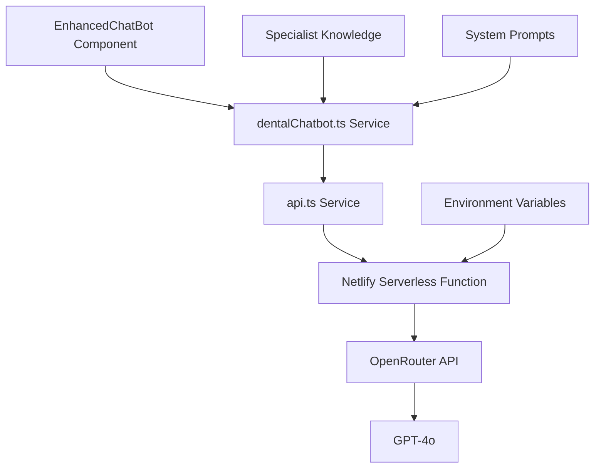

# AI Integration Documentation

This document details the AI integration implemented in Dr. Greg Pedro's dental practice website, with a focus on the OpenRouter integration, chatbot implementation, and security considerations.

## Overview

The website features an AI-powered dental assistant chatbot that provides information about Dr. Pedro's specialized services, including Yomi robotic dental implants, TMJ treatments, and EM face aesthetic procedures. The chatbot is designed to guide patients, answer questions, and facilitate appointment scheduling.

## Architecture



## Components

### 1. Frontend Components

#### EnhancedChatBot.tsx

This React component provides the user interface for the chatbot experience. Key features include:

- Chat message display with user/bot differentiation
- Message input and submission
- Loading indicators
- Action buttons for appointments, consultations, etc.
- Categorization of responses (Yomi, TMJ, EM Face, General)
- Collapsible chat window with floating button

### 2. Service Layer

#### dentalChatbot.ts

This service handles the specialized dental domain knowledge and conversation flow:

- Maintains conversation context
- Provides specialized dental knowledge as context
- Categorizes and routes queries to specialized handlers
- Formats requests for the API service
- Enhances queries with domain-specific context

```typescript
// Example of the specialist knowledge integration
const specialistKnowledge = `
Dr. Greg Pedro is the only dentist in Staten Island and one of the few in New York City to offer Yomi robotic technology for dental implant placement.

Key Procedures:
1. Yomi Robotic Dental Implants:
   - Sub-millimeter precision and accuracy
   - Minimally invasive procedures
   - Faster recovery times and less downtime
   ...
`;
```

#### api.ts

This service handles the communication with backend services:

- Formats requests for serverless functions
- Handles error states
- Provides a consistent interface for all API operations

```typescript
/**
 * Send a message to the AI chatbot via backend proxy to OpenRouter
 */
export const sendAIChatMessage = async (data: {
  messages: Array<{role: 'system' | 'user' | 'assistant', content: string}>;
  model?: string;
  maxTokens?: number;
  temperature?: number;
}): Promise<ApiResponse<{message: string}>> => {
  return apiRequest<{message: string}>('/api/ai/chat', 'POST', data);
};
```

### 3. Backend Components

#### ai-chat.js (Netlify Serverless Function)

This serverless function acts as a secure proxy between the frontend and OpenRouter:

- Securely stores and applies the OpenRouter API key
- Validates incoming requests
- Formats requests for OpenRouter
- Handles errors appropriately
- Returns structured responses

```javascript
// Example of the serverless function implementation
exports.handler = async (event, context) => {
  // Only allow POST requests
  if (event.httpMethod !== 'POST') {
    return {
      statusCode: 405,
      body: JSON.stringify({ success: false, error: 'Method Not Allowed' })
    };
  }

  try {
    // Parse the request body
    const body = JSON.parse(event.body);
    const { messages, model = 'openai/gpt-4o', maxTokens = 500, temperature = 0.7 } = body;

    // Validate required parameters
    if (!messages || !Array.isArray(messages)) {
      return {
        statusCode: 400,
        body: JSON.stringify({ success: false, error: 'Messages array is required' })
      };
    }

    // Get the API key from environment variables
    const apiKey = process.env.OPENROUTER_API_KEY;
    
    // Make request to OpenRouter...
    
    // Return the AI message
    return {
      statusCode: 200,
      headers: {
        'Content-Type': 'application/json'
      },
      body: JSON.stringify({
        success: true,
        message: data.choices[0].message.content
      })
    };
  } catch (error) {
    // Error handling...
  }
};
```

### 4. External Services

#### OpenRouter API

OpenRouter provides access to various AI models, including GPT-4o:

- Accepts requests with API key authentication
- Routes to appropriate language models
- Returns structured responses

## Implementation Details

### Prompt Engineering

The chatbot uses carefully crafted prompts to guide the AI's responses:

1. **System Prompt**: Provides context about Dr. Pedro's practice, specialized services, and desired communication style.
2. **Conversation History**: Maintains context of the ongoing conversation.
3. **User Query**: The patient's current question or statement.
4. **Specialized Context**: Additional context based on the category of the query (Yomi, TMJ, etc.).

Example system prompt structure:
```
You are Dr. Pedro's dental assistant specializing in Yomi robotic dental implants, TMJ procedures, and EM face aesthetic treatments in Staten Island, NY.

[Specialist Knowledge]

COMMUNICATION STYLE:
- Use a Socratic, thoughtful tone that guides patients to understanding
- Be concise and clear, never verbose
- Focus on accuracy and educational value
...
```

### Query Processing Flow

1. User enters a query in the chat interface
2. Frontend component sends query to the dental chatbot service
3. Service categorizes the query (Yomi, TMJ, EM Face, or general)
4. Service adds specialized context based on the category
5. Enhanced query is sent to the API service
6. API service forwards the request to the serverless function
7. Serverless function securely communicates with OpenRouter
8. Response flows back through the chain to the user

### Response Enhancement

The frontend adds interactive elements to the chatbot responses:

1. **Categorization**: Responses are labeled based on content (Yomi, TMJ, etc.)
2. **Action Buttons**: Contextual buttons are added for scheduling, information requests, etc.
3. **Formatting**: Responses are formatted for readability

## Security Implementation

### API Key Protection

- The OpenRouter API key is stored as an environment variable in Netlify
- The key is never exposed in frontend code
- All requests to OpenRouter are proxied through the serverless function

### Request Validation

- The serverless function validates all incoming requests
- Required parameters are checked before processing
- Malformed requests are rejected with appropriate error messages

### Error Handling

- Errors are caught and handled at multiple levels
- User-friendly error messages are displayed
- Detailed errors are logged for debugging but not exposed to users

### Data Handling

- Patient information is processed securely
- No sensitive information is stored in the chat interface
- User data collection is minimized and only used for the intended purpose

## Customization and Extensibility

### Adding New Specialized Knowledge

To add new specialized knowledge to the chatbot:

1. Update the `specialistKnowledge` constant in `dentalChatbot.ts`
2. Add new categorization logic to `processPatientQuery()`
3. Create a new specialized handler function if needed

### Modifying the Communication Style

To adjust the chatbot's communication style:

1. Update the system prompt in `generateDentalResponse()`
2. Test thoroughly to ensure the new style is consistent and appropriate

### Adding New Action Buttons

To add new action buttons to responses:

1. Add a new button configuration to `generateActionButtons()` in `EnhancedChatBot.tsx`
2. Implement the corresponding action handler
3. Update the `startInfoCollection()` function to handle the new action

## Testing and Quality Assurance

### Testing Approach

- Test with a variety of dental queries
- Verify that responses are accurate and helpful
- Check that specialized knowledge is appropriately incorporated
- Ensure action buttons work correctly
- Verify error handling for various failure scenarios

### Quality Guidelines

- Responses should be medically accurate
- Tone should be professional and reassuring
- Information should be helpful but not diagnostic
- Complex queries should suggest contacting the office directly

## Future Enhancements

Potential enhancements to the AI integration include:

1. **Multi-lingual Support**: Add support for languages common in Dr. Pedro's patient population
2. **Voice Interface**: Add speech-to-text and text-to-speech capabilities
3. **Appointment Scheduling Integration**: Direct integration with practice management software
4. **Personalized Responses**: Customize responses based on patient history
5. **Visual References**: Incorporate images and diagrams in responses
